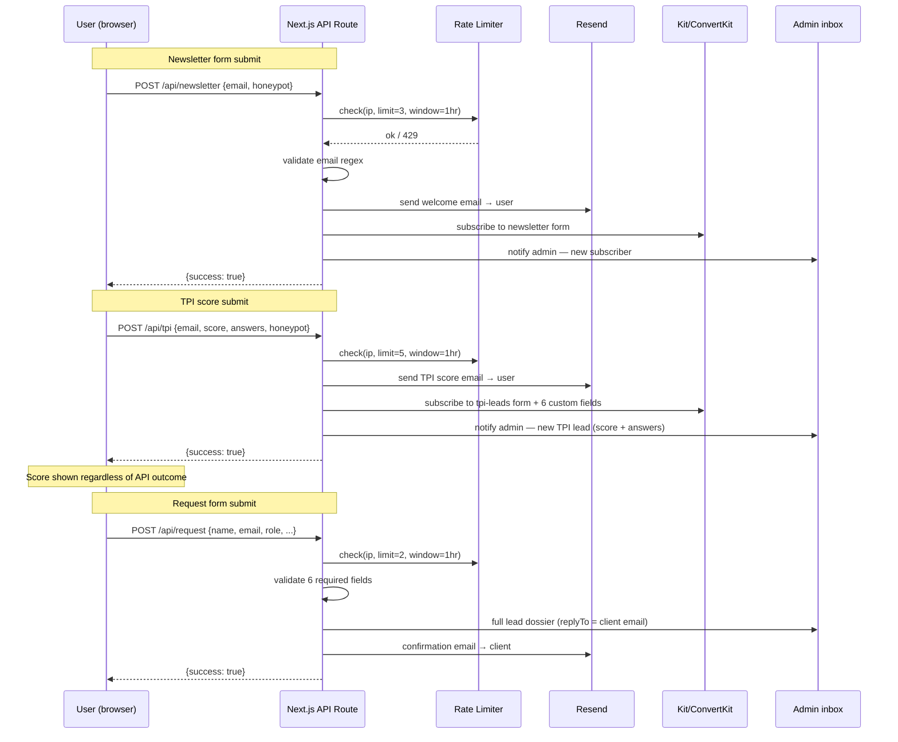
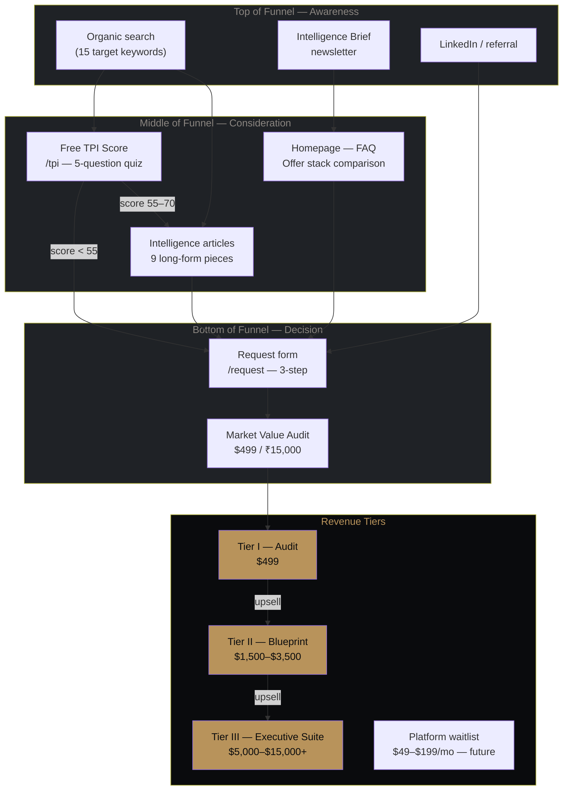
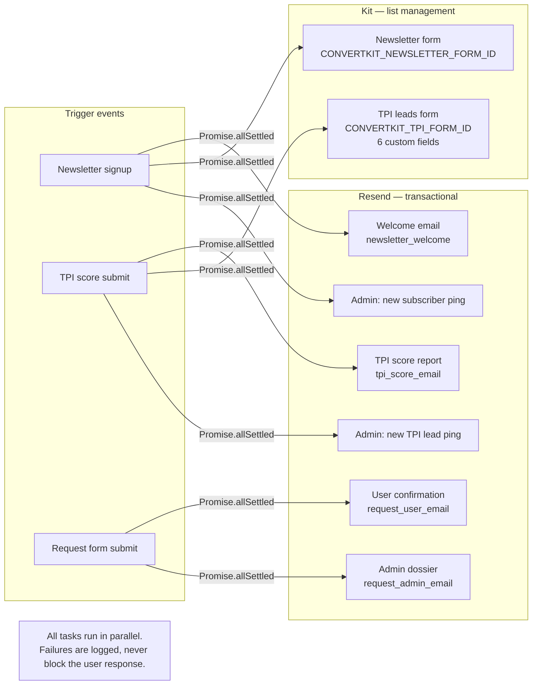

# Catalyst — Career Positioning Architecture

> **One-liner:** A Next.js 15 marketing and lead-capture system for a high-ticket professional services firm. Funnel entry is a free self-serve TPI score calculator. Exit is a $499–$15,000 consulting engagement booked via a multi-step request form.

---

## What this is

Catalyst is not a SaaS app. It's a conversion-optimised content and lead-capture site for a boutique career positioning consultancy targeting senior professionals in India, UAE, and US/UK markets.

The technical surface area is small but the lead flow is real: three transactional form endpoints backed by Resend (email delivery) and Kit/ConvertKit (list management), an in-memory IP rate limiter, honeypot spam protection, and a client-side TPI score engine that gates the result behind an email capture.

The SaaS platform section (`/platform`) describes a product in development. The pricing shown is aspirational — all CTAs route to a waitlist, not a checkout.

---

## Stack

| Layer | Choice | Version |
|---|---|---|
| Framework | Next.js App Router | 15.1.0 |
| Language | TypeScript | 5.x |
| Styling | Tailwind CSS | 3.x |
| UI runtime | React | 19 |
| Email delivery | Resend | latest |
| List management | Kit (ConvertKit) | API v4 |
| Font rendering | Google Fonts (Cormorant, Inter, JetBrains Mono) | via `next/font` |
| Icons / brand mark | Inline SVG — no icon library | — |
| Favicon | `next/og` ImageResponse | — |
| Hosting target | Vercel | — |

---

## Architecture

```
┌─────────────────────────────────────────────────────────────────┐
│                         Next.js App Router                       │
│                                                                  │
│  ┌───────────────┐   ┌──────────────────┐   ┌────────────────┐  │
│  │  Page Routes  │   │  API Route Hdlrs │   │  Static Meta   │  │
│  │  (RSC / SSG)  │   │  (Edge-compat)   │   │  sitemap.ts    │  │
│  │               │   │                  │   │  robots.ts     │  │
│  │  /            │   │  POST /api/      │   │  icon.tsx      │  │
│  │  /tpi         │   │    newsletter    │   │  apple-icon    │  │
│  │  /request     │   │    tpi           │   │  layout.tsx    │  │
│  │  /platform    │   │    request       │   └────────────────┘  │
│  │  /system      │   │                  │                        │
│  │  /intelligence│   │  rateLimit.ts    │                        │
│  │  /audit       │   │  (in-memory Map) │                        │
│  │  /blueprint   │   └──────┬───────────┘                        │
│  │  /executive   │          │                                    │
│  │  /privacy     │          │                                    │
│  │  /terms       │          ▼                                    │
│  └───────────────┘   ┌──────────────────────────────────┐       │
│                       │       lib/email/                  │       │
│                       │  resend.ts   convertkit.ts        │       │
│                       │  templates.ts (4 HTML templates)  │       │
│                       └──────┬───────────────┬───────────┘       │
└─────────────────────────────┼───────────────┼───────────────────┘
                               │               │
                    ┌──────────▼──┐   ┌────────▼──────┐
                    │   Resend    │   │  Kit/CK API   │
                    │  (SMTP out) │   │  (list mgmt)  │
                    └─────────────┘   └───────────────┘
```

---

## Directory structure

```
src/
├── app/
│   ├── layout.tsx              # Root layout — fonts, metadata, JSON-LD
│   ├── page.tsx                # Homepage (RSC, all server-renderable)
│   ├── icon.tsx                # Favicon — generated via ImageResponse
│   ├── apple-icon.tsx          # iOS icon — generated via ImageResponse
│   ├── globals.css             # Tailwind base + custom utilities
│   ├── sitemap.ts              # Sitemap — 20+ routes, priority-weighted
│   ├── robots.ts               # Robots directive
│   ├── not-found.tsx           # 404
│   │
│   ├── tpi/                    # Free TPI score page
│   ├── request/                # Multi-step booking form (3 steps)
│   ├── platform/               # SaaS platform — waitlist mode
│   ├── system/                 # "How it works" explainer
│   ├── intelligence/           # Article index + 9 SSG article pages
│   │   └── [slug]/             # generateStaticParams — 9 slugs baked at build
│   ├── audit/                  # Tier I service page
│   ├── blueprint/              # Tier II service page
│   ├── executive/              # Tier III service page
│   ├── privacy/                # Privacy policy
│   ├── terms/                  # Terms of service
│   │
│   └── api/
│       ├── newsletter/route.ts # POST — subscribe + welcome email + admin ping
│       ├── tpi/route.ts        # POST — score email + CK lead + admin ping
│       └── request/route.ts    # POST — admin dossier + user confirmation
│
├── components/
│   ├── layout/
│   │   ├── Header.tsx          # Nav — dual desktop CTAs, mobile menu
│   │   └── Footer.tsx          # 4-column + legal base bar
│   └── ui/
│       ├── TPICalculator.tsx   # Client island — 5-step quiz + email gate
│       ├── TPIMeter.tsx        # SVG arc gauge — score visualisation
│       ├── NewsletterForm.tsx  # Client island — newsletter capture
│       ├── Button.tsx          # Polymorphic — renders Link or button
│       ├── CostDiagram.tsx     # SVG cost-of-inaction diagram
│       └── InflectionMark.tsx  # Brand SVG mark — The Inflection
│
└── lib/
    ├── rateLimit.ts            # In-memory IP rate limiter (Map + cleanup)
    └── email/
        ├── resend.ts           # Resend client + FROM / ADMIN constants
        ├── convertkit.ts       # Kit form subscribe wrapper + form ID map
        └── templates.ts        # 4 inline-HTML email templates
```

---

## User flow

```mermaid
flowchart TD
    A([Cold visitor]) --> B{Entry point}

    B -->|Organic search / direct| HP[Homepage]
    B -->|LinkedIn / referral| TPI[/tpi — Free Score]
    B -->|Word of mouth| REQ[/request — Book Audit]

    HP --> HP1[Reads hero + problem section]
    HP1 --> HP2{CTA choice}
    HP2 -->|Primary — free| TPI
    HP2 -->|Secondary — paid| REQ
    HP2 -->|Scrolls further| HP3[Reads offer stack / FAQ]
    HP3 --> HP2

    TPI --> Q1[Q1: Seniority]
    Q1 --> Q2[Q2: Geography]
    Q2 --> Q3[Q3: Salary band]
    Q3 --> Q4[Q4: Last raise]
    Q4 --> Q5[Q5: Sector]
    Q5 --> EG[Email gate]
    EG -->|Valid email| SCORE[Score screen — 34–76]
    SCORE --> SCORE1{Next action}
    SCORE1 -->|High urgency score| REQ
    SCORE1 -->|Browsing| INS[/intelligence — articles]
    SCORE1 -->|Exits| EMAIL_F[Receives TPI email in inbox]

    REQ --> S1[Step 1 — Identity\nName / Email / Role / Seniority / Geo]
    S1 --> S2[Step 2 — Context\nGoals / Timeline / Background]
    S2 --> S3[Step 3 — Service\nSelect tier + referral]
    S3 -->|Submit| CONF[Confirmation screen]
    CONF --> EMAIL_R[Receives confirmation email]

    INS --> INS1[Reads article]
    INS1 --> INS2[Hits article-level audit CTA]
    INS2 --> REQ

    style SCORE fill:#B8935B,color:#0A0B0D
    style CONF fill:#B8935B,color:#0A0B0D
    style EMAIL_F fill:#1F2226,color:#F4F1EB
    style EMAIL_R fill:#1F2226,color:#F4F1EB
```

---

## Lead capture flow



---

## Conversion funnel



---

## Email infrastructure



**Kit TPI lead custom fields:**
| Field | Source |
|---|---|
| `tpi_score` | computed by score engine |
| `seniority` | Q1 answer |
| `geography` | Q2 answer |
| `salary_band` | Q3 answer |
| `last_raise` | Q4 answer |
| `sector` | Q5 answer |

---

## TPI score engine

The calculator is entirely client-side. No ML, no API call during the quiz — just a weighted lookup table.

```
base score: 52

seniority adjustment:  −2 (C-Suite) → −9 (Senior Manager)
geography adjustment:  −9 (India Tier 2/3) → +3 (UAE/GCC)
salary band:           −10 (below ₹15L) → 0 (₹1Cr+)
last raise:            −12 (3+ years ago) → +2 (within 12 months)
sector:                −5 (Government) → +4 (PE/VC)

final score = clamp(raw, 34, 76)
```

The clamp to 34–76 is intentional — leaves headroom above and below to motivate upgrade to the full paid Audit, which produces the "real" score. The email gate fires after Q5; the API call is non-blocking — the result screen renders regardless of whether the email was sent.

---

## Rate limiting

```
src/lib/rateLimit.ts — in-memory Map, keyed by IP

/api/newsletter  →  3 requests / IP / hour
/api/tpi         →  5 requests / IP / hour
/api/request     →  2 requests / IP / hour
```

Cleanup runs every 10 minutes via `setInterval`. This resets on server restart — fine for a single-instance deployment, insufficient for multi-region. If you scale horizontally, replace with Upstash Redis + `@upstash/ratelimit`.

---

## Spam protection

Every form endpoint checks a `honeypot` field that is:
- Rendered in the DOM but hidden from real users (`position: absolute; opacity: 0; pointer-events: none`)
- Never populated by the client-side submit handler (always `""`)
- Populated by most bots that auto-fill form fields

If `honeypot !== ""` on the server: the request gets a `200 {success: true}` response (to fool the bot into thinking it worked) and is silently discarded.

---

## Spam protection + iOS UX fixes

```css
/* iOS Safari auto-zooms on focus if font-size < 16px */
@media (max-width: 640px) {
  input, textarea, select {
    font-size: 16px !important;
  }
}
```

All form inputs carry `autocomplete` attributes (`name`, `email`, `organization-title`) for iOS autofill compatibility. The honeypot input has `tabIndex={-1}` and `aria-hidden="true"`.

---

## Brand tokens

| Token | Hex | Usage |
|---|---|---|
| `obsidian` | `#0A0B0D` | Page background, card backgrounds |
| `bone` | `#F4F1EB` | Primary text, headings |
| `graphite` | `#1F2226` | Borders, section dividers, subtle bg |
| `signal-gold` | `#B8935B` | CTAs, accent, brand mark stroke B |
| `muted` | `#8B8681` | Secondary text, labels |
| `parchment` | `#E6DFD1` | Warm highlight (minimal use) |

Typography:
- `font-serif` → Cormorant (editorial, seniority, headlines)
- `font-sans` → Inter (body, labels, UI copy)
- `font-mono` → JetBrains Mono (data, metadata, tags)

---

## API routes

| Route | Method | Rate limit | Auth | Side effects |
|---|---|---|---|---|
| `/api/newsletter` | POST | 3/hr/IP | none | Resend × 2, Kit subscribe |
| `/api/tpi` | POST | 5/hr/IP | none | Resend × 2, Kit subscribe + custom fields |
| `/api/request` | POST | 2/hr/IP | none | Resend × 2 (admin dossier + user confirm) |

All routes use `Promise.allSettled` — partial failures are logged to stderr, not surfaced to the client. No route writes to a database.

---

## Environment variables

```bash
# .env.local

# Resend — https://resend.com/api-keys
RESEND_API_KEY=re_...
RESEND_FROM_EMAIL=hello@yourdomain.com    # must be a verified Resend domain
RESEND_FROM_NAME=Catalyst
RESEND_ADMIN_EMAIL=you@youremail.com      # where admin pings land

# Kit (ConvertKit) — https://app.kit.com/account_settings/developer_settings
CONVERTKIT_API_KEY=...
CONVERTKIT_NEWSLETTER_FORM_ID=...        # form ID from Kit dashboard
CONVERTKIT_TPI_FORM_ID=...              # separate form with 6 custom fields
```

The TPI Kit form needs six custom fields created manually in the Kit dashboard: `tpi_score`, `seniority`, `geography`, `salary_band`, `last_raise`, `sector`. The API will silently succeed without them — the subscriber just won't have the custom field data.

---

## Security headers

Set in `next.config.ts` via `headers()`:

```
X-Content-Type-Options: nosniff
X-Frame-Options: DENY
X-XSS-Protection: 1; mode=block
Referrer-Policy: strict-origin-when-cross-origin
Permissions-Policy: camera=(), microphone=(), geolocation=()
```

---

## Pages at a glance

| Route | Type | Purpose |
|---|---|---|
| `/` | RSC | Homepage — full funnel in one page |
| `/tpi` | RSC + Client island | Free TPI score calculator |
| `/request` | Client component | 3-step booking form |
| `/platform` | RSC | SaaS platform — waitlist mode |
| `/system` | RSC | Philosophy / differentiator page |
| `/intelligence` | RSC | Article index |
| `/intelligence/[slug]` | RSC (SSG) | 9 articles, baked at build |
| `/audit` | RSC | Tier I service page |
| `/blueprint` | RSC | Tier II service page |
| `/executive` | RSC | Tier III service page |
| `/privacy` | RSC | Privacy policy |
| `/terms` | RSC | Terms of service |
| `/not-found` | RSC | 404 |

---

## What's not here

- **Payment processing** — no Stripe, no Razorpay. The request form collects intent; payment happens off-platform (invoice, bank transfer).
- **Database** — no persistence layer. Leads live in the admin's email inbox and Kit subscriber list.
- **Auth** — no login, no user accounts. Everything is public or behind the email gate in the TPI flow.
- **CMS** — intelligence articles are hardcoded in `[slug]/page.tsx`. Adding a CMS (Contentlayer, Sanity) would be the next architecture step.
- **Analytics** — no tracking scripts currently. Add Plausible or Fathom before launch (avoid GA4 for GDPR optics in this market).
- **og:image** — metadata references `/og-image.png`. That file does not exist yet. Place a 1200×630px PNG in `public/` before deploying.

---

## Deployment checklist

```
□ Copy .env.local.example → .env.local, fill real keys
□ Verify sending domain in Resend dashboard
□ Create two Kit forms, add 6 custom fields to tpi-leads form
□ Place public/og-image.png (1200×630px)
□ Run: npm run build — confirm zero errors
□ Push to Vercel, set env vars in project settings
□ Test all three forms end-to-end in production
□ Test TPI calculator — verify email arrives
□ Confirm admin notification emails land in inbox
□ Check /sitemap.xml renders all routes
□ Check favicon renders in browser tab (icon.tsx → /icon)
```
