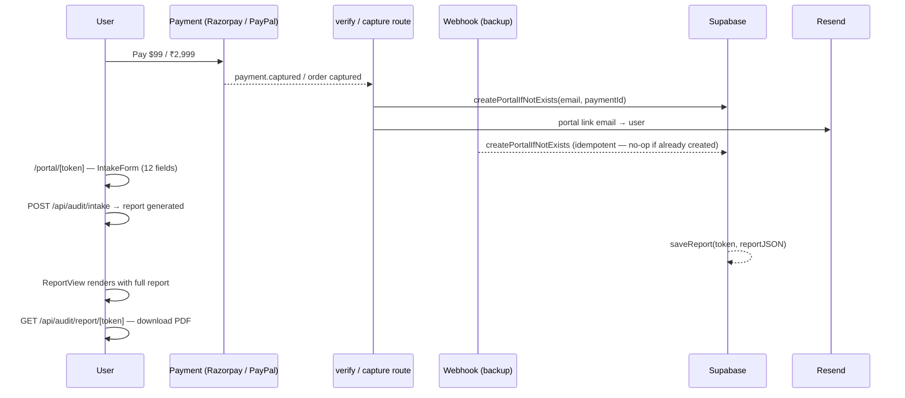
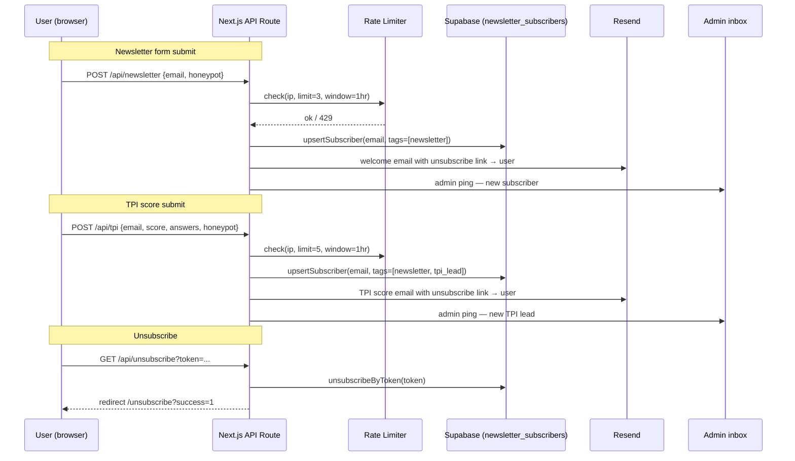
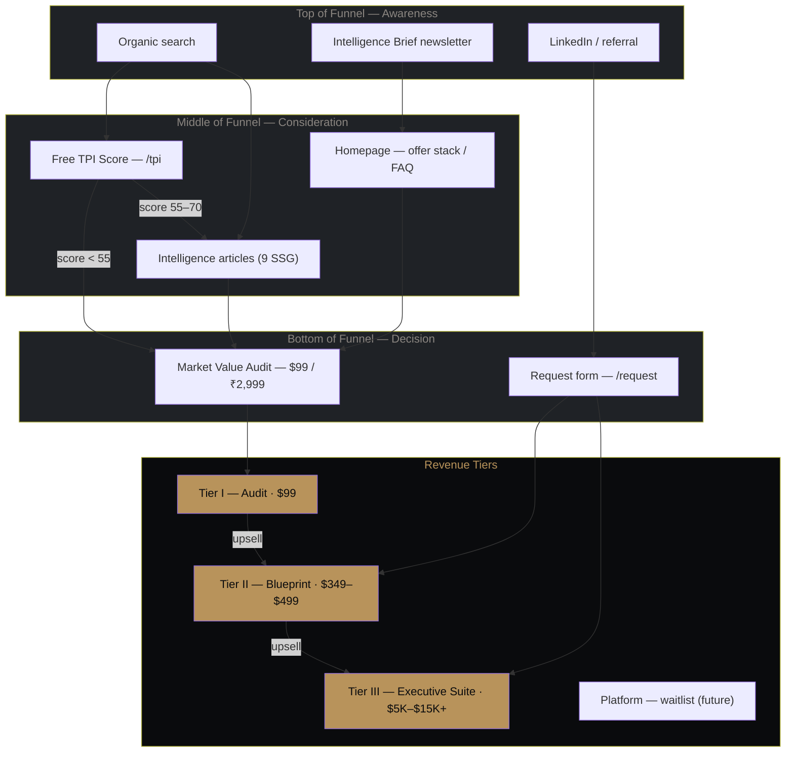

# Catalyst — Career Positioning Architecture

> **One-liner:** A Next.js 15 full-stack application for a high-ticket professional services firm. Free TPI score calculator at the top of funnel. Paid positioning intelligence report ($99 / ₹2,999) in the middle. Bespoke Blueprint and Executive Suite engagements at the top.

---

## What this is

Catalyst is a conversion-optimised content, lead-capture, and transactional site for a boutique career positioning consultancy targeting senior professionals in India, UAE, and US/UK markets.

The funnel has three layers:

1. **Free** — TPI score calculator (5-question quiz, email-gated result, triggers lead capture)
2. **Paid self-serve** — Market Value Audit ($99 / ₹2,999): user pays, receives a private portal link, fills an intake form, gets an automated positioning intelligence report + PDF
3. **Bespoke** — Blueprint ($349–$499 / ₹9,999–₹14,999) and Executive Suite ($5,000–$15,000+): enquiry via `/request`, fulfilled manually by the team

Payments are live via Razorpay (India) and PayPal (international). All paid audit data persists in Supabase.

---

## Stack

| Layer | Choice | Notes |
|---|---|---|
| Framework | Next.js App Router 15 | Mix of RSC, SSG, and client islands |
| Language | TypeScript 5.x | Strict mode |
| Styling | Tailwind CSS 3.x | Custom design tokens |
| UI runtime | React 19 | — |
| Database | Supabase (Postgres) | Service-role client, RLS enforced on sensitive tables |
| Payments — India | Razorpay | Webhooks + `fee_bearer:customer` |
| Payments — International | PayPal Orders API v2 | Raw fetch, no SDK |
| Report generation | Anthropic API (claude-sonnet-4-6) | JSON-structured TPI report, `max_tokens:4096` |
| PDF generation | `@react-pdf/renderer` | `renderToBuffer`, streamed as `application/pdf` |
| Email delivery | Resend | Lazy singleton, skips if key absent |
| List management | Internal (Supabase + Resend) | Subscriber tagging, campaign tracking, token-based unsubscribe |
| Excel export | `xlsx` | Admin CRM export — 7-sheet workbook covering all lead tables |
| Rate limiting | Upstash Redis | Sliding window; in-memory fallback for dev |
| Geo detection | Vercel `x-vercel-ip-country` header | `/api/geo` endpoint, client-side `GeoPrice` component |
| Font rendering | Google Fonts — Cormorant, Inter, JetBrains Mono | via `next/font` |
| Brand SVGs | `simple-icons` (CC0) + custom marks | Company trust rail |
| Hosting target | Vercel | `maxDuration=120` on report generation route |

---

## Architecture

```
┌──────────────────────────────────────────────────────────────────────────┐
│                            Next.js App Router                             │
│                                                                           │
│  ┌─────────────────┐   ┌────────────────────────┐   ┌─────────────────┐  │
│  │   Page Routes   │   │   API Route Handlers   │   │  Static Meta    │  │
│  │  (RSC / SSG /   │   │                        │   │  sitemap.ts     │  │
│  │   Client)       │   │  /api/geo              │   │  robots.ts      │  │
│  │                 │   │  /api/newsletter        │   │  icon.tsx       │  │
│  │  /              │   │  /api/tpi               │   │  layout.tsx     │  │
│  │  /tpi           │   │  /api/request           │   └─────────────────┘  │
│  │  /request       │   │  /api/platform-waitlist │                        │
│  │  /audit         │   │  /api/unsubscribe       │                        │
│  │  /blueprint     │   │                        │                        │
│  │  /executive     │   │  /api/audit/intake      │                        │
│  │  /portal/[tok]  │   │  /api/audit/report/[t]  │                        │
│  │  /book          │   │                        │                        │
│  │  /unsubscribe   │   │  /api/payment/razorpay  │                        │
│  │  /platform      │   │  /api/payment/paypal/*  │                        │
│  │  /system        │   │  /api/webhooks/razorpay │                        │
│  │  /intelligence  │   │  /api/webhooks/paypal   │                        │
│  │  /intelligence/ │   │                        │                        │
│  │    [slug]       │   │  /api/schedule/*        │                        │
│  │  /privacy       │   │  /api/admin/*           │                        │
│  │  /terms         │   │  /api/cron/*            │                        │
│  └─────────────────┘   └──────────┬─────────────┘                        │
│                                    │                                      │
└────────────────────────────────────┼──────────────────────────────────────┘
                                     │
          ┌──────────────────────────┼──────────────────────────┐
          │                          │                          │
   ┌──────▼──────┐          ┌────────▼──────┐         ┌────────▼────────┐
   │  Supabase   │          │  Resend       │         │  Razorpay /     │
   │  (Postgres) │          │  Email +      │         │  PayPal         │
   │  portals    │          │  newsletters  │         │  Payments       │
   │  payments   │          └───────────────┘         └─────────────────┘
   │  bookings   │
   │  leads      │          ┌───────────────┐
   │  subscribers│          │  Anthropic    │
   │  newsletters│          │  Report gen   │
   └─────────────┘          └───────────────┘
```

---

## Directory structure

```
src/
├── app/
│   ├── layout.tsx                      # Root layout — fonts, metadata, JSON-LD
│   ├── page.tsx                        # Homepage — full funnel in one page
│   ├── globals.css                     # Tailwind base + custom utilities
│   ├── sitemap.ts                      # Sitemap — all routes, priority-weighted
│   ├── robots.ts                       # Robots directive
│   ├── not-found.tsx                   # 404
│   │
│   ├── tpi/                            # Free TPI score calculator
│   ├── audit/                          # Tier I service page + checkout
│   │   └── success/                    # Post-payment confirmation
│   ├── blueprint/                      # Tier II service page
│   ├── executive/                      # Tier III service page
│   ├── portal/
│   │   └── [token]/page.tsx            # Private audit portal (force-dynamic)
│   ├── book/                           # Scheduling flow
│   │   ├── success/                    # Booking confirmed
│   │   └── cancel/                     # Booking cancelled
│   ├── request/                        # High-ticket enquiry form
│   ├── unsubscribe/                    # Unsubscribe confirmation page
│   ├── platform/                       # SaaS platform — waitlist mode
│   ├── system/                         # Philosophy / differentiator page
│   ├── intelligence/                   # Article index + SSG articles
│   │   └── [slug]/                     # generateStaticParams — baked at build
│   ├── privacy/                        # Privacy policy
│   ├── terms/                          # Terms of service
│   │
│   └── api/
│       ├── geo/route.ts                # GET — Vercel IP country → {isIndia}
│       ├── newsletter/route.ts         # POST — subscribe + welcome email
│       ├── tpi/route.ts                # POST — TPI score email + subscriber tag
│       ├── request/route.ts            # POST — admin dossier + user confirm
│       ├── platform-waitlist/route.ts  # POST — waitlist signup
│       ├── unsubscribe/route.ts        # GET  — token unsubscribe → redirect
│       │
│       ├── audit/
│       │   ├── intake/route.ts         # POST — validate intake, run report (maxDuration=120)
│       │   └── report/[token]/route.tsx# GET  — stream PDF of completed report
│       │
│       ├── payment/
│       │   ├── razorpay/route.ts       # POST — create Razorpay order
│       │   ├── razorpay/verify/route.ts# POST — verify signature, create portal (rate limited)
│       │   ├── paypal/create/route.ts  # POST — create PayPal order
│       │   └── paypal/capture/route.ts # POST — capture PayPal order, create portal (rate limited)
│       │
│       ├── webhooks/
│       │   ├── razorpay/route.ts       # POST — HMAC-verified webhook, idempotent portal creation
│       │   └── paypal/route.ts         # POST — PayPal IPN webhook, idempotent portal creation
│       │
│       ├── schedule/                   # Availability + booking management
│       ├── admin/
│       │   ├── auth/                   # Admin login
│       │   ├── bookings/               # Booking list
│       │   ├── availability/           # Slot management
│       │   └── newsletter/
│       │       ├── send/route.ts       # POST — send campaign to active subscribers
│       │       └── subscribers/route.ts# GET  — subscriber list + campaign history
│       └── cron/                       # Scheduled reminders (*/15) + cleanup (*/5)
│
├── components/
│   ├── layout/
│   │   ├── Header.tsx                  # Nav — geo-priced CTA, mobile menu
│   │   └── Footer.tsx                  # 4-column + disclaimer + legal base
│   ├── portal/
│   │   ├── IntakeForm.tsx              # 12-field intake (client component)
│   │   └── ReportView.tsx              # Report display + PDF download button
│   ├── admin/
│   │   └── AdminDashboard.tsx          # 4-tab admin: Bookings, Availability, CRM, Newsletter
│   ├── booking/
│   │   └── BookingFlow.tsx             # Calendar + slot picker
│   └── ui/
│       ├── AuditCheckout.tsx           # Email → payment two-step checkout
│       ├── PaymentButton.tsx           # Razorpay (INR) + PayPal (USD) switcher
│       ├── GeoPrice.tsx                # Client component — geo-aware price display
│       ├── CompanyLogos.tsx            # Brand SVG trust rail (simple-icons + custom)
│       ├── Disclaimer.tsx              # Results disclaimer (compact + full variants)
│       ├── TPICalculator.tsx           # 5-step quiz + email gate (client island)
│       ├── TPIMeter.tsx                # SVG arc gauge — score visualisation
│       ├── PricingSection.tsx          # Tier comparison grid
│       ├── NewsletterForm.tsx          # Newsletter capture (client island)
│       ├── PlatformWaitlist.tsx        # Platform waitlist form
│       ├── Button.tsx                  # Polymorphic — Link or button
│       ├── CostDiagram.tsx             # SVG cost-of-inaction diagram
│       └── InflectionMark.tsx          # Brand SVG mark
│
└── lib/
    ├── constants/
    │   └── pricing.ts                  # Single source of truth for all prices (paise/cents)
    ├── geo.ts                          # Geo detection helper
    ├── rateLimit.ts                    # Upstash Redis sliding window + in-memory fallback
    ├── auth/
    │   └── admin.ts                    # Admin cookie auth (8hr session)
    ├── booking/
    │   └── confirmAndNotify.ts         # Shared booking confirmation — used by all 4 payment paths
    ├── db/
    │   ├── supabase.ts                 # Service-role Supabase client + typed insert helpers
    │   ├── portals.ts                  # createPortalIfNotExists (idempotent, race-safe)
    │   ├── bookings.ts                 # Booking CRUD
    │   └── newsletter.ts               # Subscriber management + campaign tracking
    ├── email/
    │   ├── resend.ts                   # Resend singleton + FROM / ADMIN constants
    │   ├── convertkit.ts               # No-op stub (ConvertKit removed)
    │   ├── templates.ts                # Transactional + marketing HTML email templates
    │   └── bookingTemplates.ts         # Booking confirmation email templates
    ├── payment/
    │   ├── razorpay.ts                 # Order creation with fee_bearer:customer
    │   └── paypal.ts                   # PayPal Orders API v2 (raw fetch, email in custom_id)
    ├── pdf/
    │   └── ReportPdf.tsx               # react-pdf report layout
    └── schedule/
        ├── slots.ts                    # Availability slot generation
        └── timezone.ts                 # IANA timezone helpers
```

---

## Pricing (single source of truth)

All prices are stored in paise/cents in `src/lib/constants/pricing.ts` and referenced everywhere — payment routes, GeoPrice component, email templates.

| Product | USD | INR |
|---|---|---|
| Market Value Audit | $99 | ₹2,999 |
| Momentum Sprint | $199 | ₹5,999 |
| Positioning Blueprint | $349 | ₹9,999 |
| Executive Blueprint | $499 | ₹14,999 |
| Executive Suite | $5,000–$15,000+ | ₹5,00,000–₹15,00,000+ |

Geo-detection is server-side via Vercel's `x-vercel-ip-country` header. The `GeoPrice` client component fetches `/api/geo` on mount and swaps from the USD default — no layout shift for non-India users.

---

## Payment and portal flow



Both the client-side verify/capture route **and** the payment gateway webhook attempt portal creation. `createPortalIfNotExists` is idempotent at both application and database level (UNIQUE constraint on `payment_id` + 23505 race handling) — only one portal is ever created per payment.

---

## Lead capture and newsletter flow



---

## Conversion funnel



---

## API routes

| Route | Method | Rate limit | Auth | Side effects |
|---|---|---|---|---|
| `/api/geo` | GET | — | none | reads Vercel IP header |
| `/api/newsletter` | POST | 3/hr/IP | none | Supabase upsert, Resend × 2 |
| `/api/tpi` | POST | 5/hr/IP | none | Supabase upsert + TPI insert, Resend × 2 |
| `/api/request` | POST | 2/hr/IP | none | Resend × 2 |
| `/api/platform-waitlist` | POST | 3/hr/IP | none | Supabase insert, Resend |
| `/api/unsubscribe` | GET | — | token | Supabase status update → redirect |
| `/api/audit/intake` | POST | 3/hr/IP | portal token | Anthropic, Supabase write, Resend |
| `/api/audit/report/[token]` | GET | — | portal token | Supabase read, PDF stream |
| `/api/payment/razorpay` | POST | — | none | Razorpay order create |
| `/api/payment/razorpay/verify` | POST | 10/hr/IP | none | HMAC verify, Supabase portal + payment |
| `/api/payment/paypal/create` | POST | — | none | PayPal order create |
| `/api/payment/paypal/capture` | POST | 10/hr/IP | none | PayPal capture, Supabase portal + payment |
| `/api/webhooks/razorpay` | POST | — | HMAC sig | idempotent portal + booking confirmation |
| `/api/webhooks/paypal` | POST | — | PayPal verify | idempotent portal + booking confirmation |
| `/api/schedule/*` | GET/POST | — | none / admin | Supabase bookings |
| `/api/admin/newsletter/send` | POST | — | admin cookie | Resend batch send, Supabase campaign record |
| `/api/admin/newsletter/subscribers` | GET | — | admin cookie | Supabase read |
| `/api/admin/crm` | GET | — | admin cookie | Merged lead view across all 7 tables |
| `/api/admin/crm/export` | GET | — | admin cookie | Multi-sheet Excel download (xlsx) |
| `/api/admin/*` | GET/POST | — | admin cookie | Supabase bookings |
| `/api/cron/reminders` | GET | — | CRON_SECRET | Resend reminders (*/15 min) |
| `/api/cron/cleanup` | GET | — | CRON_SECRET | DB booking cleanup (*/5 min) |

---

## TPI score engine

Entirely client-side — no API call during the quiz.

```
base score: 52

seniority adjustment:  −2 (C-Suite) → −9 (Senior Manager)
geography adjustment:  −9 (India Tier 2/3) → +3 (UAE/GCC)
salary band:           −10 (below ₹15L) → 0 (₹1Cr+)
last raise:            −12 (3+ years ago) → +2 (within 12 months)
sector:                −5 (Government) → +4 (PE/VC)

final score = clamp(raw, 34, 76)
```

Clamped to 34–76 intentionally — leaves headroom to motivate the paid Audit. The TPI email sends the score with an audit CTA at $99 / ₹2,999. Email gate fires after Q5; result renders regardless of API outcome.

---

## Newsletter system

The newsletter system is fully internal — no third-party email marketing service.

**Subscriber storage** — `newsletter_subscribers` table in Supabase. Each subscriber has:
- `status` — `active` | `unsubscribed`
- `tags` — `TEXT[]` array (`newsletter`, `tpi_lead`, `audit_buyer`)
- `unsubscribe_token` — unique random 32-byte hex token generated at subscribe time
- `source` — origin of the subscription (`newsletter_form`, `tpi_calculator`, etc.)

**Unsubscribe** — Every marketing email contains a unique `/api/unsubscribe?token=...` link. The GET handler marks the subscriber unsubscribed and redirects to `/unsubscribe?success=1`. Re-submitting a newsletter or TPI form never silently re-subscribes an opted-out address.

**Campaign send** — `POST /api/admin/newsletter/send` (admin-authenticated). Accepts `subject`, `html`, and optional `segment` (tag filter). Sends in batches of 50 via Resend, appends a per-recipient unsubscribe footer, records the campaign in the `newsletters` table.

---

## Rate limiting

`src/lib/rateLimit.ts` — Upstash Redis sliding window with in-memory `Map` fallback.

The in-memory fallback resets on server restart — acceptable for single-instance dev. In production on Vercel (multi-region), Upstash Redis must be configured to share state across instances.

---

## Spam protection

Every form endpoint checks a `honeypot` field:
- Rendered in the DOM but hidden from users (`position: absolute; opacity: 0; pointer-events: none`)
- Never sent by the legitimate submit handler (always `""`)
- If `honeypot !== ""`: returns `200 {success: true}` and silently discards the request

---

## Brand tokens

| Token | Hex | Usage |
|---|---|---|
| `obsidian` | `#0A0B0D` | Page background, card backgrounds |
| `bone` | `#F4F1EB` | Primary text, headings |
| `graphite` | `#1F2226` | Borders, section dividers, subtle bg |
| `signal-gold` | `#B8935B` | CTAs, accent, brand mark |
| `muted` | `#8C8C96` | Secondary text, labels |
| `parchment` | `#E6DFD1` | Warm highlight (minimal use) |

Typography:
- `font-serif` → Cormorant (editorial, headings)
- `font-sans` → Inter (body, labels, UI copy)
- `font-mono` → JetBrains Mono (data, metadata, tags)

---

## Pages at a glance

| Route | Type | Purpose |
|---|---|---|
| `/` | RSC | Homepage — full funnel in one page |
| `/tpi` | RSC + Client island | Free TPI score calculator |
| `/audit` | RSC | Tier I — Market Value Audit ($99) |
| `/audit/success` | RSC | Post-payment confirmation |
| `/portal/[token]` | Dynamic RSC + Client | Private audit portal — intake + report |
| `/book` | Client | Scheduling flow |
| `/book/success` | RSC | Booking confirmed |
| `/book/cancel` | RSC | Booking cancelled |
| `/blueprint` | RSC | Tier II — Positioning Blueprint |
| `/executive` | RSC | Tier III — Sovereign Executive Suite |
| `/request` | Client | High-ticket enquiry form |
| `/unsubscribe` | RSC | Unsubscribe confirmation |
| `/platform` | RSC | SaaS platform — waitlist mode |
| `/system` | RSC | Philosophy / differentiator page |
| `/intelligence` | RSC | Article index |
| `/intelligence/[slug]` | RSC (SSG) | 9 articles, baked at build |
| `/privacy` | RSC | Privacy policy |
| `/terms` | RSC | Terms of service |

---

## Environment variables

```bash
# ─── RESEND
RESEND_API_KEY=re_...
RESEND_FROM_EMAIL=catalyst@yourdomain.com
RESEND_FROM_NAME=Catalyst
RESEND_ADMIN_EMAIL=you@youremail.com

# ─── ANTHROPIC (AI report generation — required for Market Value Audit)
# https://console.anthropic.com/account/keys
ANTHROPIC_API_KEY=sk-ant-api03-...

# ─── SUPABASE
# Run migrations in supabase/migrations/ in the Supabase SQL editor before first run
SUPABASE_URL=https://xxxx.supabase.co
SUPABASE_SERVICE_ROLE_KEY=eyJ...

# ─── UPSTASH REDIS (rate limiting — in-memory fallback if not set)
UPSTASH_REDIS_REST_URL=https://xxxx.upstash.io
UPSTASH_REDIS_REST_TOKEN=...

# ─── RAZORPAY (India)
RAZORPAY_KEY_ID=rzp_live_...
RAZORPAY_KEY_SECRET=...
RAZORPAY_WEBHOOK_SECRET=...
NEXT_PUBLIC_RAZORPAY_KEY_ID=rzp_live_...

# ─── PAYPAL (International)
PAYPAL_MODE=live
PAYPAL_CLIENT_ID=...
PAYPAL_CLIENT_SECRET=...
PAYPAL_WEBHOOK_ID=...
NEXT_PUBLIC_PAYPAL_CLIENT_ID=...

# ─── SITE
NEXT_PUBLIC_BASE_URL=https://www.catalyst.theripplenexus.com

# ─── ADMIN (scheduling + cron)
ADMIN_SECRET=long-random-string
ADMIN_TIMEZONE=Asia/Kolkata
CRON_SECRET=another-long-random-string

# ─── ANALYTICS (optional)
NEXT_PUBLIC_PLAUSIBLE_DOMAIN=catalyst.theripplenexus.com
```

---

## Supabase schema

Run migrations in `supabase/migrations/` sequentially in the Supabase SQL editor before first use.

| Table | Purpose |
|---|---|
| `audit_portals` | One row per paid audit — token, email, payment_id (UNIQUE), report JSON, status |
| `payments` | Payment record per transaction — gateway, amount, currency, idempotency |
| `newsletter_subscribers` | Subscribers with status, tags, source, phone, and unsubscribe token |
| `newsletters` | Campaign send history — subject, segment, sent count, sent timestamp |
| `tpi_submissions` | TPI quiz results and lead data |
| `leads` | High-ticket enquiry form submissions |
| `platform_waitlist` | Platform interest signups with optional phone number |
| `bookings` | Scheduled meeting records |
| `meeting_types` | Available meeting types and durations |

---

## Security headers

Set in `next.config.ts` via `headers()`:

```
X-Content-Type-Options: nosniff
X-Frame-Options: DENY
X-XSS-Protection: 1; mode=block
Referrer-Policy: strict-origin-when-cross-origin
Permissions-Policy: camera=(), microphone=(), geolocation=()
```

---

## Deployment checklist

```
□ Copy .env.local.example → .env.local, fill all real keys
□ Run supabase/migrations/001_portal_payment_integrity.sql in Supabase SQL editor
□ Run supabase/migrations/002_newsletter_system.sql in Supabase SQL editor
□ Run supabase/migrations/003_phone_fields.sql in Supabase SQL editor (adds phone to newsletter_subscribers + platform_waitlist)
□ Verify sending domain in Resend dashboard
□ Enable Customer Fee Bearer in Razorpay dashboard (Settings → Payment Methods)
□ Set RAZORPAY_WEBHOOK_SECRET in Vercel (Razorpay Dashboard → Webhooks → endpoint → Secret)
□ Set PAYPAL_WEBHOOK_ID in Vercel (PayPal Developer → Apps → Webhooks → Webhook ID)
□ Place public/og-image.png (1200×630px)
□ Run: npm run build — confirm zero errors
□ Push to Vercel; set all env vars in project settings
□ Set NEXT_PUBLIC_BASE_URL to the live domain in Vercel
□ Test Razorpay payment end-to-end — verify portal email arrives
□ Test PayPal payment end-to-end — verify portal email arrives
□ Kill browser mid-payment (simulate UPI kill) — verify webhook creates portal
□ Submit intake form in portal — verify report generates and PDF downloads
□ Test TPI calculator — verify score email arrives with unsubscribe link
□ Test newsletter subscribe — verify welcome email arrives with unsubscribe link
□ Test unsubscribe link — verify /unsubscribe?success=1 and no re-subscribe
□ Confirm admin notification emails land in inbox
□ Test /request form — verify admin dossier + user confirmation
□ Check /sitemap.xml renders all routes
□ Verify Razorpay webhook signature verification passes in Vercel logs
```
